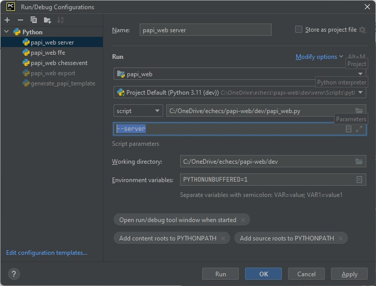
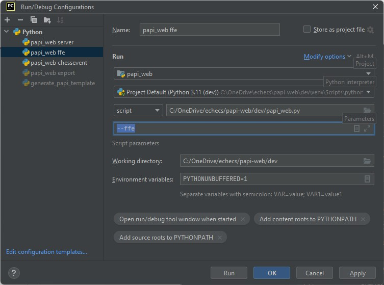
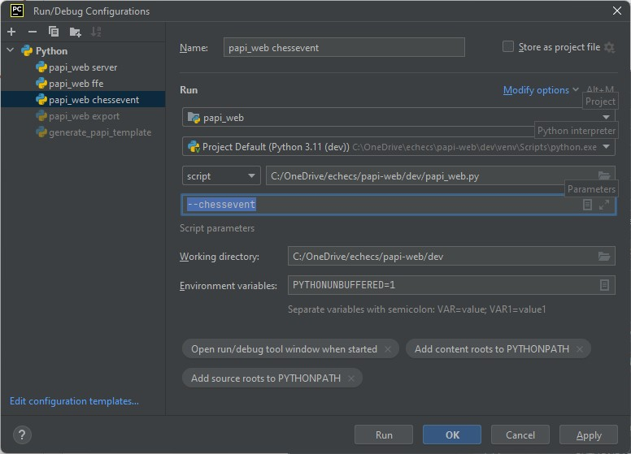
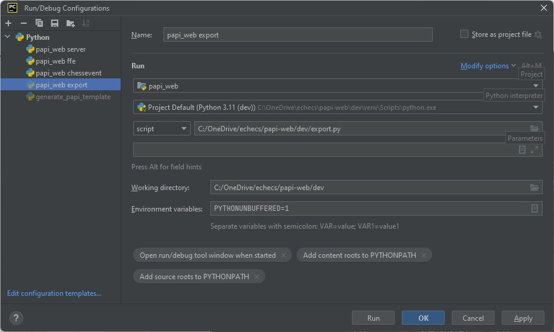

**[Retour au sommaire de la documentation](../README.md)**

# Papi-web - Annexe technique : Configuration d'un environnement de développement

At this time, [pascalaubry](https://github.com/pascalaubry) uses PyCharm 2024.3 (Community Edition) on up-to-date Windows 11.

Simply checkout from https://github.com/papi-web-org/papi-web and play ;-)

## Configuration du plugin requirements

Le plugin **requirements** de PyCharm, qui assure le contrôle des versions des bibliothèques définies dans `/requirements.txt`, n'est plus maintenu depuis octobre 2022 :

- [Dépôt officiel du plugin JetBrains](https://github.com/JetBrains/requirements)

Il est indiqué sur [cette page](https://plugins.jetbrains.com/plugin/10837-requirements/reviews#107728) qu'un fork du plugin a été créé où les numéros de compatibilité ont été modifiés pour fonctionner les dernières versions de PyCharm :

- [Dépôt du plugin censé fonctionner](https://github.com/ilBEastli/requirements-pycharm-plugin)

Malheureusement ce plugin ne fonctionne pas :

```
CreateRequirementsFileAction#presentation@MainMenu (ru.meanmail.actions.CreateRequirementsFileAction), actionId=requirements.NewRequirementsFile, text='requirements.txt'

java.lang.NoClassDefFoundError: com/jetbrains/extensions/ModuleExtKt
	at ru.meanmail.PackageUtilsKt.getPythonSdk(PackageUtils.kt:22)
	at ru.meanmail.actions.CreateRequirementsFileAction.isAvailable(CreateRequirementsFileAction.kt:41)
	at com.intellij.ide.actions.CreateFromTemplateAction.update(CreateFromTemplateAction.java:158)
	at com.intellij.openapi.actionSystem.ex.ActionUtil.performDumbAwareUpdate$lambda$2(ActionUtil.kt:226)
	at com.intellij.openapi.actionSystem.ex.ActionUtil.performDumbAwareUpdate(ActionUtil.kt:244)
	at com.intellij.openapi.actionSystem.impl.ActionUpdater$updateAction$success$1$1$1.invoke(ActionUpdater.kt:501)
	at com.intellij.openapi.actionSystem.impl.ActionUpdater$updateAction$success$1$1$1.invoke(ActionUpdater.kt:500)
	at com.intellij.openapi.actionSystem.impl.ActionUpdater$callAction$2$1.invoke(ActionUpdater.kt:145)
	at com.intellij.openapi.application.rw.InternalReadAction.insideReadAction(InternalReadAction.kt:114)
	at com.intellij.openapi.application.rw.InternalReadAction.tryReadCancellable$lambda$4(InternalReadAction.kt:104)
	at com.intellij.openapi.application.rw.CancellableReadActionKt.cancellableReadActionInternal$lambda$3$lambda$2$lambda$1(cancellableReadAction.kt:32)
	at com.intellij.openapi.application.impl.AnyThreadWriteThreadingSupport.tryRunReadAction(AnyThreadWriteThreadingSupport.kt:351)
	at com.intellij.openapi.application.impl.ApplicationImpl.tryRunReadAction(ApplicationImpl.java:971)
	at com.intellij.openapi.application.rw.CancellableReadActionKt.cancellableReadActionInternal$lambda$3$lambda$2(cancellableReadAction.kt:30)
	at com.intellij.openapi.progress.util.ProgressIndicatorUtilService.runActionAndCancelBeforeWrite(ProgressIndicatorUtilService.java:66)
	at com.intellij.openapi.progress.util.ProgressIndicatorUtils.runActionAndCancelBeforeWrite(ProgressIndicatorUtils.java:157)
	at com.intellij.openapi.application.rw.CancellableReadActionKt.cancellableReadActionInternal(cancellableReadAction.kt:28)
	at com.intellij.openapi.application.rw.InternalReadAction.tryReadCancellable(InternalReadAction.kt:103)
	at com.intellij.openapi.application.rw.InternalReadAction.tryReadAction(InternalReadAction.kt:87)
	at com.intellij.openapi.application.rw.InternalReadAction.readLoop(InternalReadAction.kt:74)
	at com.intellij.openapi.application.rw.InternalReadAction.access$readLoop(InternalReadAction.kt:16)
	at com.intellij.openapi.application.rw.InternalReadAction$runReadAction$3.invokeSuspend(InternalReadAction.kt:36)
	at com.intellij.openapi.application.rw.InternalReadAction$runReadAction$3.invoke(InternalReadAction.kt)
	at com.intellij.openapi.application.rw.InternalReadAction$runReadAction$3.invoke(InternalReadAction.kt)
	at kotlinx.coroutines.intrinsics.UndispatchedKt.startUndispatchedOrReturn(Undispatched.kt:62)
	at kotlinx.coroutines.CoroutineScopeKt.coroutineScope(CoroutineScope.kt:261)
	at com.intellij.openapi.application.rw.InternalReadAction.runReadAction(InternalReadAction.kt:35)
	at com.intellij.openapi.application.rw.PlatformReadWriteActionSupport.executeReadAction(PlatformReadWriteActionSupport.kt:38)
	at com.intellij.openapi.application.ReadWriteActionSupport.executeReadAction$default(ReadWriteActionSupport.kt:15)
	at com.intellij.openapi.application.CoroutinesKt.constrainedReadActionUndispatched(coroutines.kt:86)
	at com.intellij.openapi.application.CoroutinesKt.readActionUndispatched(coroutines.kt:73)
	at com.intellij.openapi.actionSystem.impl.ActionUpdater$callAction$$inlined$useWithScope$1.invokeSuspend(trace.kt:61)
	at com.intellij.openapi.actionSystem.impl.ActionUpdater$callAction$$inlined$useWithScope$1.invoke(trace.kt)
	at com.intellij.openapi.actionSystem.impl.ActionUpdater$callAction$$inlined$useWithScope$1.invoke(trace.kt)
	at kotlinx.coroutines.intrinsics.UndispatchedKt.startUndispatchedOrReturn(Undispatched.kt:62)
	at kotlinx.coroutines.BuildersKt__Builders_commonKt.withContext(Builders.common.kt:163)
	at kotlinx.coroutines.BuildersKt.withContext(Unknown Source)
	at com.intellij.openapi.actionSystem.impl.ActionUpdater.callAction(ActionUpdater.kt:882)
	at com.intellij.openapi.actionSystem.impl.ActionUpdater.access$callAction(ActionUpdater.kt:77)
	at com.intellij.openapi.actionSystem.impl.ActionUpdater$updateAction$success$1$1.invokeSuspend(ActionUpdater.kt:500)
	at com.intellij.openapi.actionSystem.impl.ActionUpdater$updateAction$success$1$1.invoke(ActionUpdater.kt)
	at com.intellij.openapi.actionSystem.impl.ActionUpdater$updateAction$success$1$1.invoke(ActionUpdater.kt)
	at com.intellij.openapi.actionSystem.impl.ActionUpdater$updateAction$$inlined$retryOnAwaitSharedData$1.invokeSuspend(ActionUpdater.kt:831)
	at com.intellij.openapi.actionSystem.impl.ActionUpdater$updateAction$$inlined$retryOnAwaitSharedData$1.invoke(ActionUpdater.kt)
	at com.intellij.openapi.actionSystem.impl.ActionUpdater$updateAction$$inlined$retryOnAwaitSharedData$1.invoke(ActionUpdater.kt)
	at kotlinx.coroutines.intrinsics.UndispatchedKt.startUndispatchedOrReturn(Undispatched.kt:62)
	at kotlinx.coroutines.BuildersKt__Builders_commonKt.withContext(Builders.common.kt:163)
	at kotlinx.coroutines.BuildersKt.withContext(Unknown Source)
	at com.intellij.openapi.actionSystem.impl.ActionUpdater.updateAction(ActionUpdater.kt:933)
	at com.intellij.openapi.actionSystem.impl.ActionUpdater.access$updateAction(ActionUpdater.kt:77)
	at com.intellij.openapi.actionSystem.impl.ActionUpdater$iterateGroupChildren$1$tree$1.invokeSuspend(ActionUpdater.kt:447)
	at com.intellij.openapi.actionSystem.impl.ActionUpdater$iterateGroupChildren$1$tree$1.invoke(ActionUpdater.kt)
	at com.intellij.openapi.actionSystem.impl.ActionUpdater$iterateGroupChildren$1$tree$1.invoke(ActionUpdater.kt)
	at com.intellij.openapi.actionSystem.impl.ActionUpdater$iterateGroupChildren$1.invokeSuspend(ActionUpdater.kt:463)
	at kotlin.coroutines.jvm.internal.BaseContinuationImpl.resumeWith(ContinuationImpl.kt:33)
	at kotlinx.coroutines.UndispatchedCoroutine.afterResume(CoroutineContext.kt:277)
	at kotlinx.coroutines.AbstractCoroutine.resumeWith(AbstractCoroutine.kt:99)
	at kotlin.coroutines.jvm.internal.BaseContinuationImpl.resumeWith(ContinuationImpl.kt:46)
	at kotlinx.coroutines.DispatchedTask.run(DispatchedTask.kt:104)
	at kotlinx.coroutines.internal.LimitedDispatcher$Worker.run(LimitedDispatcher.kt:111)
	at kotlinx.coroutines.scheduling.TaskImpl.run(Tasks.kt:99)
	at kotlinx.coroutines.scheduling.CoroutineScheduler.runSafely(CoroutineScheduler.kt:608)
	at kotlinx.coroutines.scheduling.CoroutineScheduler$Worker.executeTask(CoroutineScheduler.kt:873)
	at kotlinx.coroutines.scheduling.CoroutineScheduler$Worker.runWorker(CoroutineScheduler.kt:763)
	at kotlinx.coroutines.scheduling.CoroutineScheduler$Worker.run(CoroutineScheduler.kt:750)
Caused by: java.lang.ClassNotFoundException: com.jetbrains.extensions.ModuleExtKt PluginClassLoader(plugin=PluginDescriptor(name=Requirements, id=ru.meanmail.plugin.requirements, descriptorPath=plugin.xml, path=~\AppData\Roaming\JetBrains\PyCharmCE2024.3\plugins\requirements-2024.1.1.jar, version=2024.1.1, package=null, isBundled=false), packagePrefix=null, state=active, parents=PluginDescriptor(name=Python Community Edition, id=PythonCore, moduleName=intellij.python.terminal, descriptorPath=intellij.python.terminal.xml, path=C:\Program Files\JetBrains\PyCharm Community Edition 2024.2.4\plugins\python-ce, version=243.21565.199, package=com.intellij.python.terminal, isBundled=true), PluginDescriptor(name=Python Community Edition, id=PythonCore, moduleName=intellij.python.markdown, descriptorPath=intellij.python.markdown.xml, path=C:\Program Files\JetBrains\PyCharm Community Edition 2024.2.4\plugins\python-ce, version=243.21565.199, package=com.intellij.python.markdown, isBundled=true), PluginDescriptor(name=Python Community Edition, id=PythonCore, moduleName=intellij.python.langInjection, descriptorPath=intellij.python.langInjection.xml, path=C:\Program Files\JetBrains\PyCharm Community Edition 2024.2.4\plugins\python-ce, version=243.21565.199, package=com.intellij.python.langInjection, isBundled=true), PluginDescriptor(name=Python Community Edition, id=PythonCore, moduleName=intellij.python.grazie, descriptorPath=intellij.python.grazie.xml, path=C:\Program Files\JetBrains\PyCharm Community Edition 2024.2.4\plugins\python-ce, version=243.21565.199, package=com.intellij.python.grazie, isBundled=true), PluginDescriptor(name=Python Community Edition, id=PythonCore, moduleName=intellij.python.featuresTrainer, descriptorPath=intellij.python.featuresTrainer.xml, path=C:\Program Files\JetBrains\PyCharm Community Edition 2024.2.4\plugins\python-ce, version=243.21565.199, package=com.intellij.python.featuresTrainer, isBundled=true), PluginDescriptor(name=Python Community Edition, id=PythonCore, moduleName=intellij.python.copyright, descriptorPath=intellij.python.copyright.xml, path=C:\Program Files\JetBrains\PyCharm Community Edition 2024.2.4\plugins\python-ce, version=243.21565.199, package=com.intellij.python.copyright, isBundled=true), PluginDescriptor(name=Python Community Edition, id=PythonCore, moduleName=intellij.python.community.plugin.minorRider, descriptorPath=intellij.python.community.plugin.minorRider.xml, path=C:\Program Files\JetBrains\PyCharm Community Edition 2024.2.4\plugins\python-ce, version=243.21565.199, package=com.intellij.python.community.plugin.minorRider, isBundled=true), PluginDescriptor(name=Python Community Edition, id=PythonCore, moduleName=intellij.python.community.plugin.minor, descriptorPath=intellij.python.community.plugin.minor.xml, path=C:\Program Files\JetBrains\PyCharm Community Edition 2024.2.4\plugins\python-ce, version=243.21565.199, package=com.intellij.python.community.plugin.minor, isBundled=true), PluginDescriptor(name=Python Community Edition, id=PythonCore, moduleName=intellij.python.community.plugin.java, descriptorPath=intellij.python.community.plugin.java.xml, path=C:\Program Files\JetBrains\PyCharm Community Edition 2024.2.4\plugins\python-ce, version=243.21565.199, package=com.intellij.python.community.plugin.java, isBundled=true), PluginDescriptor(name=Python Community Edition, id=PythonCore, moduleName=intellij.python.community.plugin.impl, descriptorPath=intellij.python.community.plugin.impl.xml, path=C:\Program Files\JetBrains\PyCharm Community Edition 2024.2.4\plugins\python-ce, version=243.21565.199, package=com.intellij.python.community.plugin.impl, isBundled=true), PluginDescriptor(name=Python Community Edition, id=PythonCore, moduleName=intellij.python.community.impl.huggingFace, descriptorPath=intellij.python.community.impl.huggingFace.xml, path=C:\Program Files\JetBrains\PyCharm Community Edition 2024.2.4\plugins\python-ce, version=243.21565.199, package=com.intellij.python.community.impl.huggingFace, isBundled=true), PluginDescriptor(name=Python Community Edition, id=PythonCore, moduleName=intellij.python.community.communityOnly, descriptorPath=intellij.python.community.communityOnly.xml, path=C:\Program Files\JetBrains\PyCharm Community Edition 2024.2.4\plugins\python-ce, version=243.21565.199, package=com.intellij.python.community.communityOnly, isBundled=true), PluginDescriptor(name=Python Community Edition, id=PythonCore, moduleName=intellij.commandInterface, descriptorPath=intellij.commandInterface.xml, path=C:\Program Files\JetBrains\PyCharm Community Edition 2024.2.4\plugins\python-ce, version=243.21565.199, package=com.intellij.commandInterface, isBundled=true), PluginDescriptor(name=IDEA CORE, id=com.intellij, moduleName=intellij.platform.vcs.impl, descriptorPath=intellij.platform.vcs.impl.xml, path=C:\Program Files\JetBrains\PyCharm Community Edition 2024.2.4\lib, version=243.21565.199, package=null, isBundled=true), PluginDescriptor(name=IDEA CORE, id=com.intellij, moduleName=intellij.platform.vcs.log.impl, descriptorPath=intellij.platform.vcs.log.impl.xml, path=C:\Program Files\JetBrains\PyCharm Community Edition 2024.2.4\lib, version=243.21565.199, package=null, isBundled=true), PluginDescriptor(name=IDEA CORE, id=com.intellij, moduleName=intellij.platform.vcs.dvcs.impl, descriptorPath=intellij.platform.vcs.dvcs.impl.xml, path=C:\Program Files\JetBrains\PyCharm Community Edition 2024.2.4\lib, version=243.21565.199, package=null, isBundled=true), PluginDescriptor(name=IDEA CORE, id=com.intellij, moduleName=intellij.platform.collaborationTools, descriptorPath=intellij.platform.collaborationTools.xml, path=C:\Program Files\JetBrains\PyCharm Community Edition 2024.2.4\lib, version=243.21565.199, package=null, isBundled=true), PluginDescriptor(name=Python Community Edition, id=PythonCore, descriptorPath=plugin.xml, path=C:\Program Files\JetBrains\PyCharm Community Edition 2024.2.4\plugins\python-ce, version=243.21565.199, package=com.jetbrains.python, isBundled=true), )
	... 65 more
```

Les autres forks ont été testés le 17/11/2024, en vain.

- [forks du plugin JetBrains](https://github.com/JetBrains/requirements/forks)

## Lancement des scripts depuis l'environnement de développement

### Lancement du serveur web



### Lancement de l'interface avec le serveur fédéral



### Lancement de l'interface avec la plateforme ChessEvent



## Création d'un exécutable Windows pour diffusion



L'exécutable est créé dans le répertoire `..\export`.
